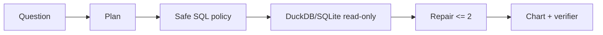

# DataPilot Agent

自然语言数据分析 Agent：数据剖析、只读 SQL、错误修复、图表规格和结论一致性验证。

```powershell
$env:DATAPILOT_MOCK='1'
uv run --extra dev streamlit run src/datapilot/ui.py
uv run --extra dev uvicorn datapilot.api:app --reload
uv run --extra dev python evals/run_eval.py --mock --output evals/report.json
```

模型模式只从 `DEEPSEEK_API_KEY`、`DEEPSEEK_BASE_URL`、`DEEPSEEK_MODEL` 读取配置，密钥不会进入代码或日志。项目默认使用 Mock 模式。



可量化指标：SQL 执行成功率、修复成功率、不安全 SQL 拦截率、平均延迟。第一版不执行模型生成的 Python，也不声称生产规模。
